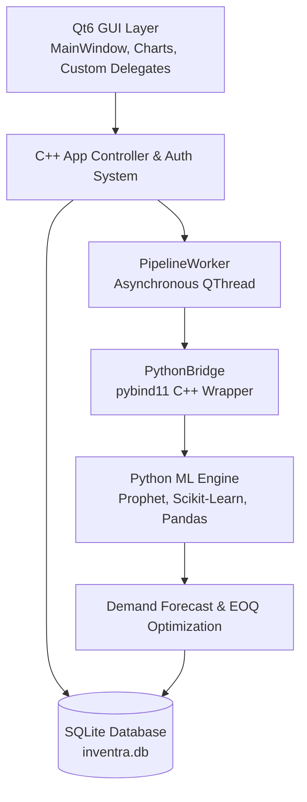

# 📦 Inventra

**Inventra** is a high-performance, intelligent Kirana & retail store management system built with modern **C++ (Qt6)** and an embedded **Machine Learning pipeline (Python & pybind11)**. It bridges desktop UI speed and database reliability with machine learning models for demand forecasting, stockout risk classification, and Economic Order Quantity (EOQ) optimization.

---

## 📸 Key Features & Capabilities

- ⚡ **Native C++ Performance**: Built with C++17/C++20 and Qt 6 (with Qt 5 fallback support) for ultra-fast startup and smooth rendering across platforms.
- 🤖 **Embedded ML Engine**: Interoperability between C++ and Python via `pybind11` running asynchronously off-thread using `QThread`.
- 📈 **Demand Forecasting**: Automated time-series sales forecasting powered by Meta `Prophet` and exponential smoothing algorithms.
- 🎯 **Stockout Risk & Priority Ranking**: Classification models (`scikit-learn`, `imbalanced-learn`) categorize items into **Critical**, **Reorder Soon**, and **Safe** tiers.
- 📐 **EOQ Optimization**: Built-in Wilson Economic Order Quantity engine calculating optimal batch reordering to minimize holding and ordering costs.
- 🔐 **Role-Based Auth & Session Lock**: PIN-hashed security for Owners and Staff with automatic idle lock timers.
- 📊 **Interactive Analytics & Dashboard**: Visual widgets, revenue analytics, real-time metrics, stock level badges, and trend charts.
- 📦 **Inventory & Stock Management**: Bulk Stock-In/Stock-Out tracking, low-stock threshold alerts, barcode support, supplier data, and item categorization.
- 🎨 **Dual-Theme Engine**: Seamless runtime toggle between **Dark Glassmorphism** and **Light Terminal** themes.
- 💾 **Embedded SQLite Persistence**: Zero-configuration local database (`inventra.db`) with automatic schema migration and CSV data importer.

---

## 🏗️ Architecture & Technology Stack



### Core Technologies

| Layer | Technologies Used |
| :--- | :--- |
| **GUI & Frontend** | C++17/C++20, Qt 6 Widgets (`QTableView`, `QCharts`), QtAwesome, QSS Styling Engine |
| **Core Architecture** | MVC Pattern, Asynchronous Threading (`QThread`), `QAbstractTableModel` |
| **Database** | SQLite 3 via `Qt6::Sql` with automatic migrations |
| **Embedded Bridge** | `pybind11` (v2.13+) embedded C++/Python interpreter |
| **ML & Analytics** | Python 3.10+, `prophet`, `scikit-learn`, `imbalanced-learn`, `pandas`, `numpy` |
| **Build System** | CMake 3.22+, MSVC / MinGW / GCC, `windeployqt` |

---

## 📁 Repository Structure

```
Inventra/
├── CMakeLists.txt              # Primary CMake build configuration
├── CMakePresets.json           # Build presets for Ninja & MSVC
├── rebuild.bat                 # Windows one-click clean rebuild script
├── run_inventra.bat            # Windows startup script
│
├── src/                        # Modern C++ Core Application
│   ├── main.cpp                # Application entry point & initialization
│   ├── core/                   # Business logic & persistence
│   │   ├── Database.h/.cpp     # SQLite wrapper, migrations, and queries
│   │   ├── AppController.h/.cpp# State controller & data coordinator
│   │   ├── AuthController.h/.cpp# PIN security & user authentication
│   │   ├── ThemeManager.h/.cpp # Theme tokens & QSS engine
│   │   └── PipelineWorker.h/.cpp # Asynchronous ML worker thread
│   ├── python/                 # C++ pybind11 integration layer
│   │   └── PythonBridge.h/.cpp # C++/Python struct mapping & bridge
│   ├── ui/                     # Qt Widget views & user interfaces
│   │   ├── MainWindow.cpp      # Top-level application shell & navigation
│   │   ├── AuthWidget.cpp      # Login & PIN entry screen
│   │   ├── DashboardWidget.cpp # Metrics cards, quick actions & charts
│   │   ├── ProductCatalogWidget.cpp # Inventory catalog & filters
│   │   ├── DailyEntryWidget.cpp# Sales logging & daily balance checks
│   │   ├── StockWidget.cpp     # Bulk Stock IN/OUT management
│   │   ├── AnalyticsWidget.cpp # ML demand forecasting & risk charts
│   │   ├── ImportWidget.cpp    # Bulk CSV data importer
│   │   └── SettingsWidget.cpp  # Shop profile, themes & configuration
│   └── widgets/                # Custom reusable UI controls
│       ├── MetricCard.cpp      # Stat card widget
│       ├── BadgeDelegate.cpp   # Table view delegate for stock status
│       └── QtAwesome.cpp       # FontAwesome icon delegate
│
├── python/                     # Embedded Python ML pipeline
│   ├── data_module.py          # Data extraction & preprocessing
│   ├── model_module.py         # ML model training & classification
│   └── prediction_module.py    # Forecasting & EOQ integration
│
├── backend/                    # Python ML backend services & algorithms
│   ├── ml/                     # ML modules (forecasting, EOQ, priority)
│   ├── database/               # Python-side database interfaces
│   └── tests/                  # PyTest suite for ML services
│
├── resources/                  # App assets, icons, themes, and QRC files
└── doc/                        # Project documentation & specs
```

---

## 🛠️ Prerequisites & Setup

### 1. Requirements

- **C++ Compiler**: MSVC 2019/2022 (Windows), MinGW-w64, or GCC/Clang (Linux/macOS) supporting C++17 or C++20.
- **Qt Framework**: Qt 6.4+ (or Qt 5.15 fallback) with `Core`, `Widgets`, `Sql`, and `Charts` modules.
- **CMake**: Version 3.22 or higher.
- **Python (Optional for ML features)**: Python 3.10+ with required packages.

### 2. Installing Python ML Dependencies

If you plan to enable the embedded Machine Learning pipeline (`INVENTRA_ENABLE_PYTHON=ON`), install the required Python packages:

```bash
pip install pandas numpy scikit-learn imbalanced-learn prophet
```

---

## 🚀 Building & Running

### Windows (Visual Studio / NMake / Ninja)

Using the provided `rebuild.bat` script:
```cmd
rebuild.bat
```

Or configure and build manually via CMake:
```cmd
mkdir build
cd build
cmake .. -DCMAKE_PREFIX_PATH="C:/Qt/6.8.3/msvc2022_64" -DINVENTRA_ENABLE_PYTHON=ON
nmake
```

To run the built executable:
```cmd
build\Inventra.exe
```

### Linux / macOS

```bash
mkdir build && cd build
cmake .. -DCMAKE_PREFIX_PATH="/path/to/Qt/6.x/gcc_64" -DINVENTRA_ENABLE_PYTHON=ON
make -j$(nproc)
./Inventra
```

---

## 💾 Database Schema

Inventra manages local persistence using SQLite (`inventra.db`). Key database tables include:

- `users`: User accounts, hashed PINs, and roles (`Owner`, `Staff`).
- `shop_profile`: Business details (Shop Name, Owner Name, Contact, Address).
- `products`: Product catalog, SKU, barcode, unit cost, retail price, stock levels, reorder points.
- `daily_entries`: Daily sales records, cash drawer tracking, and notes.
- `stock_movements`: Stock IN / OUT movement logs with timestamps and reason codes.
- `session_settings`: Local application configuration and theme preferences.
- `pipeline_results`: Cached outputs from ML demand forecasting and priority scoring runs.

---

## 🧪 Testing

Run backend Python ML tests:
```bash
python test_backend.py
```

Run SQLite database integration test:
```bash
python test_db.py
```

---

## 📄 License

This project is released under the **MIT License**.